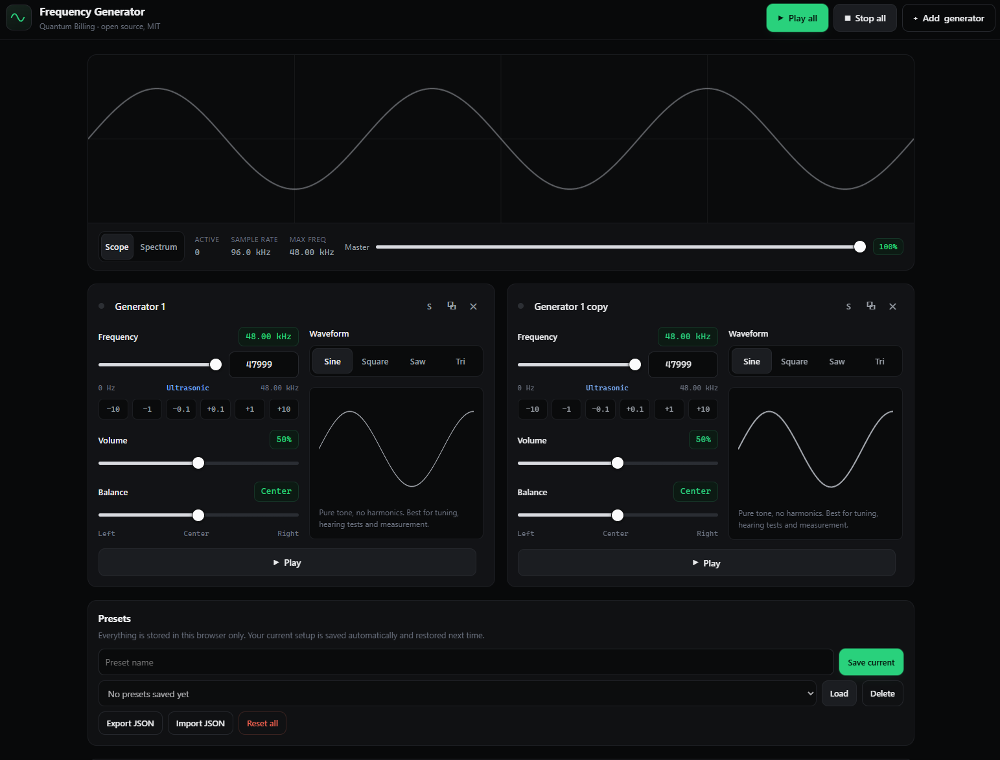

# Frequency Generator

A browser-based signal generator: several independent oscillators at once, from
**0 Hz up to the ultrasonic limit of your audio hardware**, with everything you
set up remembered in your own browser.

Built and open-sourced by **Quantum Billing** under the MIT License.

**▶ Live app: https://codejq.github.io/Frequency-Generator/**



*Two generators at the top of the ultrasonic range on a 96 kHz audio context.
The sample rate and the resulting 48 kHz ceiling are shown under the scope —
both depend on the device.*

---

## Features

| | |
|---|---|
| **Multiple generators** | Add as many oscillator widgets as you need (up to 32). Play one, play a few, or play all of them together. |
| **Per-generator controls** | Frequency, waveform, volume and stereo balance, all independent. |
| **Wide range** | 0 Hz (DC) through infrasound, the full audible band, and ultrasonic content up to the Nyquist limit — 24 kHz at a 48 kHz sample rate, up to ~48 kHz where the browser grants a 96 kHz context. |
| **Four waveforms** | Sine, square, sawtooth, triangle. |
| **Solo / Play all / Stop all** | One tap to isolate a tone or to sound the whole set. Space bar toggles everything. |
| **Live visualiser** | Oscilloscope and log-scaled spectrum view of the actual output. |
| **Note readout** | Shows the nearest musical note and the cent offset, for tuning work. |
| **Presets** | Save named setups, reload them later, delete what you no longer need. |
| **Automatic session memory** | Your current setup is saved as you change it and restored on your next visit. Anything that was playing is offered as a one-tap resume. |
| **Import / export** | Move your session and presets between browsers and devices as a JSON file. |
| **English and Arabic** | Full interface in both, with proper right-to-left layout. Auto-detected, switchable in the header, remembered. |
| **Mobile first** | Responsive down to small phone screens, with touch-sized controls. |
| **Install to home screen** | Add it as a shortcut and it opens full screen like an app — no store, no download. |
| **Offline** | Installable as a PWA; a service worker keeps it working with no connection. |
| **Animal deterrent presets** | One tap sets up the frequencies commonly claimed for mosquitoes, rodents, cats and dogs. Read the caveats below first. |
| **Private** | No accounts, no analytics, no network calls. All state lives in `localStorage` on your device. |

## Uses

Speaker and headphone testing, hearing range checks, tuning instruments,
calibrating measurement equipment, generating beat frequencies from two close
tones, room-mode and resonance hunting, ultrasonic transducer testing.

## Languages

The interface ships in **English and Arabic**, in one page rather than two
builds — a shared link works for everyone and there is only one copy to deploy.

- The language is picked automatically from the browser, and the choice you make
  in the header is remembered.
- `?lang=ar` and `?lang=en` force one, which is what to link to when sharing.
- Arabic switches the document to `dir="rtl"` and the whole layout mirrors.

One deliberate exception: **sliders, their scales and the nudge buttons stay
left-to-right in both languages.** Those controls are physical, not linguistic —
low frequency belongs at the low end of the travel, and the left speaker belongs
on the left. Only the surrounding text mirrors. Values keep Western digits and
`Hz`/`kHz`, as Arabic technical interfaces conventionally do, and each value is
isolated from the bidi algorithm so `440.0 Hz` never renders as `Hz 440.0`.

Adding a third language means adding one block to
[docs/assets/js/i18n.js](docs/assets/js/i18n.js); CI fails the build if it does not cover
every key the other has.

## Install it on your phone — no app store

Open the site on a phone and it offers to add itself to your home screen. Accept
and it launches full screen, works offline, and behaves like an installed app.
Phase 2 packages the same code for the stores; for most people this is already
enough.

- **Android / Chrome / Edge:** a bar appears offering *Install*. One tap hands
  off to the browser's own install dialog.
- **iPhone / iPad:** Safari has no install API, so the app shows the steps
  instead — Share button → *Add to Home Screen*.
- Dismissing it is respected: the prompt stays away for two weeks.

**A page cannot install itself, by design.** No browser lets a site create a
shortcut silently — it requires a user gesture and the browser's own permission
dialog. What the app does is take the earliest moment the browser offers
(`beforeinstallprompt`), ask you plainly, and pass your answer straight through.
That is as close to automatic as the platform permits, and the reason is
obvious: otherwise any page you opened could plant an icon on your phone.

Installability requires the manifest, a service worker and HTTPS — all three are
in place on GitHub Pages, but none of them work over `file://`.

## Chasing animals away

The deterrent panel adds a generator at the frequency usually claimed for a
given animal: mosquitoes 17 kHz, rodents 22 kHz, cats 23 kHz, dogs 25 kHz.
Nothing plays until you press Play on the card. Sine waves are used rather than
square: at these frequencies a square wave's harmonics are past the Nyquist
limit and buy nothing.

**Be realistic about whether this works.** Independent studies have repeatedly
found ultrasonic mosquito repellents ineffective — mosquitoes are not repelled
by ultrasound, and several regulators have acted against products claiming
otherwise. Results for cats, dogs and rodents are mixed at best: animals
habituate to a constant tone quickly. On top of that, most phone speakers roll
off above roughly 15 kHz, so a phone may emit almost nothing at 22–25 kHz even
at full volume. The generator will faithfully produce the frequency; whether
your hardware radiates it, and whether any animal cares, is another matter.

**And be careful with it.** Do not aim it at a pet at close range or leave it
running near one — these frequencies sit well inside a cat's or dog's hearing
range and can genuinely distress them. Anything you cannot hear can still be
loud enough to damage hearing, including that of children and young adults, who
hear higher frequencies than most adults do.

## Run it

No build step, no dependencies. Any static file server works:

```bash
git clone https://github.com/codejq/Frequency-Generator.git
cd Frequency-Generator/docs

python -m http.server 8080     # or: npx serve .
# open http://localhost:8080
```

Serve the **`docs/` folder**, not the repository root - that folder is the web
root. Opening `docs/index.html` straight from the filesystem works too, except
that the service worker (offline mode) will not register on `file://`.

## Deploying

Pages is configured as **Deploy from a branch → `main` → `/docs`**, so
`docs/` is the web root and GitHub republishes the site on every push to
`main` by itself. There is no deploy workflow to run.

That is why the app lives in `docs/` rather than the repository root, and why
every path inside it is relative - which is also what makes the project
sub-path (`/Frequency-Generator/`) work without any base-URL configuration.

One consequence worth knowing: **branch deployments are not gated by CI.** A
push to `main` goes live whether or not the checks pass. If you would rather
have the checks gate the deploy, switch **Settings → Pages → Source** to
**GitHub Actions** and restore the deploy workflow - it is in the git history
at `.github/workflows/deploy-pages.yml`, and only needs its upload path
changed from `.` to `./docs`.

### Workflow

| Workflow | Trigger | Does |
|---|---|---|
| `.github/workflows/ci.yml` | pushes to `main`, pull requests, manual | Runs the static checks. |

## Checks

```bash
node scripts/verify.mjs
```

Verifies that every script parses, the manifest is valid JSON, every path
referenced by `index.html`, precached by the service worker or embedded in this
README exists, every element id and class the JavaScript looks up is in the
markup, and the licence is present. It also checks that **the two dictionaries
cover exactly the same keys** and that every key the page asks for is defined —
a missing Arabic string falls back to English silently at runtime, which is
precisely the gap nobody notices until a user reports it. A broken relative path
is the other failure that looks fine locally and 404s on Pages.

## Project layout

```
docs/                              the published site (GitHub Pages web root)
  index.html                       markup and the generator card template
  manifest.webmanifest             PWA metadata
  sw.js                            service worker (network-first, cache fallback)
  assets/css/styles.css            all styling, including the RTL rules
  assets/js/storage.js             localStorage wrapper, guarded for private mode
  assets/js/i18n.js                English and Arabic dictionaries, direction switch
  assets/js/audio-engine.js        Web Audio: context, master bus, per-voice chains
  assets/js/app.js                 state, UI, presets, visualiser
  assets/js/install.js             add-to-home-screen prompt
  ROADMAP.md                       phase 2: Android and iOS
  screenshot.png                   the image above
scripts/verify.mjs                 static checks used by CI
```

Plain ES5-compatible JavaScript, no framework, no bundler. The whole app is a
handful of files you can read in one sitting — deliberately, since it has to be
straightforward to wrap in a mobile shell later.

## How it works

Each generator owns one `OscillatorNode → GainNode → StereoPannerNode` chain
feeding a shared master gain and analyser. Voices start and stop independently,
which is what makes arbitrary subsets play together.

Two details worth knowing:

- **Gain ramps, not switches.** Starting or stopping at full amplitude is a
  step change, and a step change is an audible click carrying broadband energy.
  Every start, stop and volume change ramps over ~20 ms; frequency changes glide
  over ~30 ms.
- **The frequency slider is logarithmic.** It maps to `10^(x·k) − 1`, so 0 Hz
  sits exactly at the bottom of the travel while the audible decades still get
  usable resolution. A linear 0–48000 slider would put everything below 1 kHz in
  the first 2% of its travel.

The top frequency is the Nyquist limit — half the sample rate. The app asks for
a 96 kHz context first and falls back to whatever the device gives it; the
actual rate and ceiling are shown under the visualiser.

## Safety

Sustained tones can damage hearing and equipment. Start quiet. Ultrasonic
content is inaudible but still real energy through your tweeters, and it is easy
to leave something running loud that you cannot hear.

## Roadmap

Phase 1 (this repository) is the web app. Phase 2 wraps the same codebase as
native Android and iOS apps — see [docs/ROADMAP.md](docs/ROADMAP.md).

## Contributing

Issues and pull requests are welcome. Keep it dependency-free, keep it working
on a phone, and make sure `node scripts/verify.mjs` passes.

## Licence

MIT — see [LICENSE](LICENSE). Copyright © 2026 Quantum Billing.
